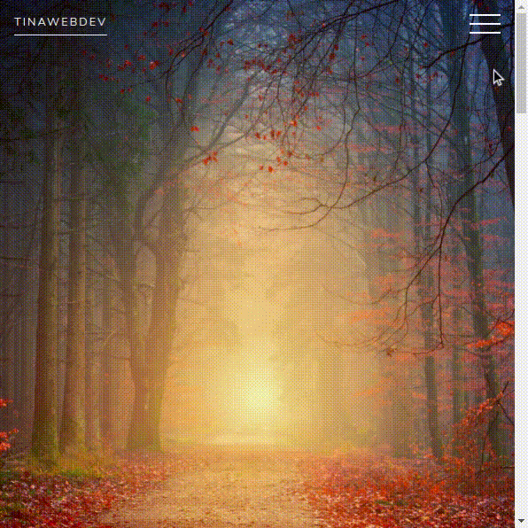

# Animated Navigation
A website example using CSS Animation and JavaScript.

## Demo
You can view a live version [here](https://tinawebdev.github.io/javascript-projects/animated-navigation/).

## How to use
Getting a copy of this project up and running is simple, just clone the repo, go to the `animated-navigation` folder and open the index file in a browser.
* Download the repository using the [instruction](https://help.github.com/en/github/creating-cloning-and-archiving-repositories/cloning-a-repository).
* Go to the project folder and open the `index.html` file. All done.

## Tools

* Fonts from [Google Fonts](https://fonts.google.com/)
* Freely-usable images: [Unsplash API](https://unsplash.com/developers/)
* Image color picker [imagecolorpicker.com](https://imagecolorpicker.com/)
